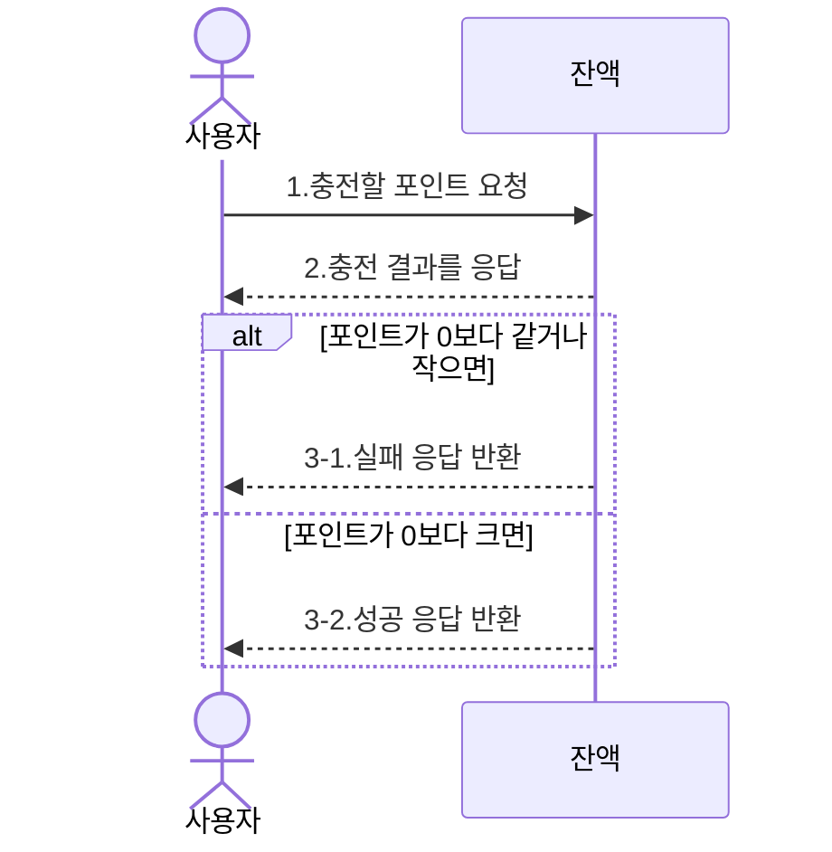
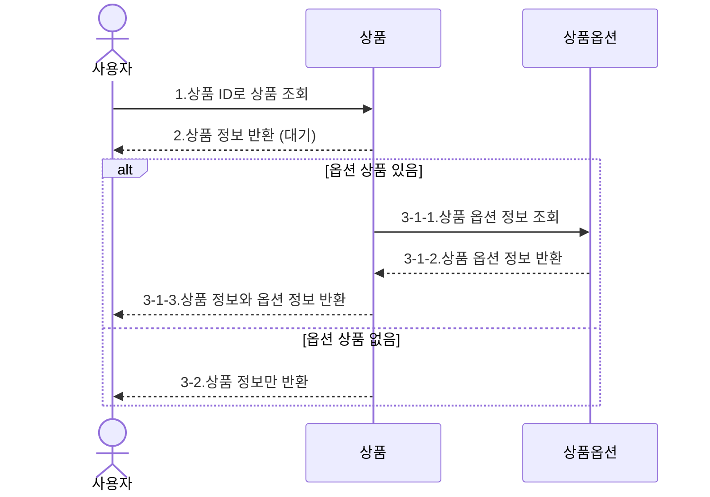
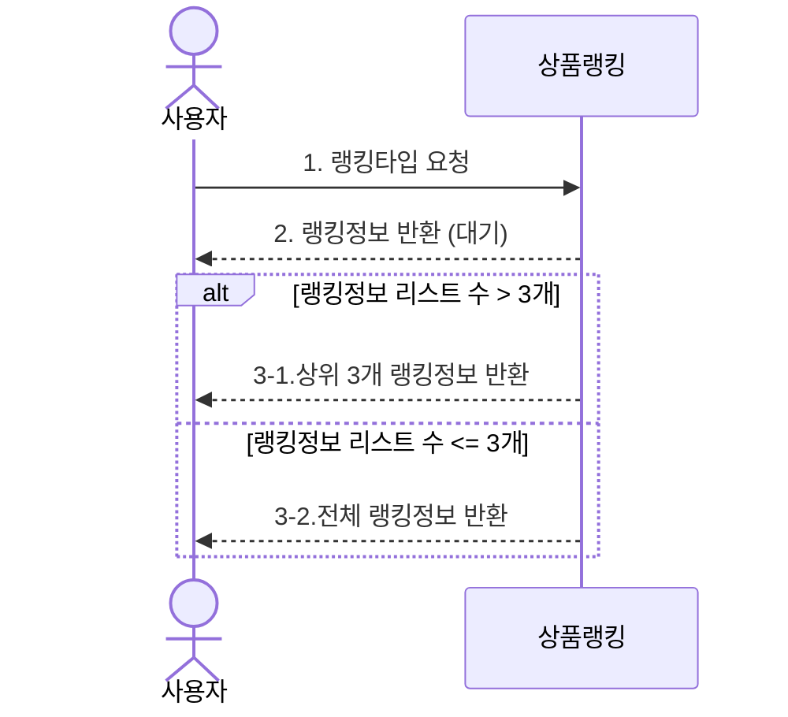
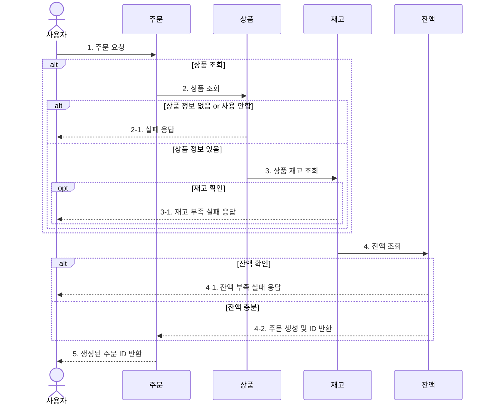
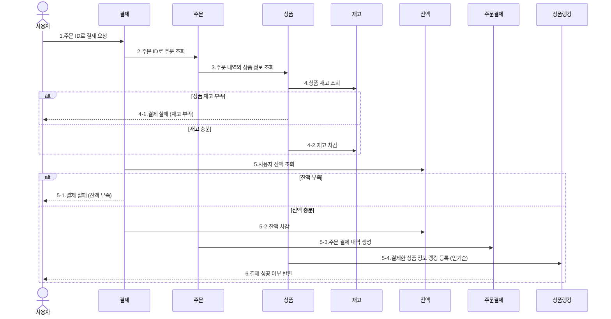

[Chapter 2] 서버구축
===========================

> 우리는 적절한 아키텍처 패턴, 클린 코드, 테스트 등을 준수하며 유지, 성장 가능한 애플리케이션을 만들어야 합니다.

Service Scenario
----------------
**e-커머스 서비스**
- **Description**
  - `e-커머스 상품 주문 서비스`를 구현해 봅니다.
  - 상품 주문에 필요한 메뉴 정보들을 구성하고 조회가 가능해야 합니다.
  - 사용자는 상품을 여러개 선택해 주문할 수 있고, 미리 충전한 잔액을 이용합니다.
  - 상품 주문 내역을 통해 판매량이 가장 높은 상품을 추천합니다.

Requirements
------------
* 아래 4가지 API 를 구현합니다.
  + 잔액 충전 / 조회 API
  + 상품 조회 API
  + 주문 / 결제 API
  + 인기 판매 상품 조회 API
* 각 기능 및 제약 사항에 대해 단위 테스트를 반드시 하나 이상 작성하도록 합니다.
* 다수의 인스턴스로 어플리케이션이 동작하더라도 기능에 문제가 없도록 작성하도록 합니다.
* 동시성 이슈를 고려하여 구현합니다.
* 재고 관리에 문제 없도록 구현합니다.
**동시에 여러 주문이 들어올 경우, 유저의 보유 잔고에 대한 처리가 정확해야 합니다.**
**각 상품의 재고 관리가 정상적으로 이루어져 잘못된 주문이 발생하지 않도록 해야 합니다.**

개발 환경 준비
--------------
- **Architecture**
    - Testable Business logics
    - Layered Architecture Based
    - (+) Clean / Hexagonal Architecture
- **DB ORM**
    - JPA / MyBatis
- **Test**
    - JUnit + AssertJ

Milestone
----------
[E-commerce 마일스톤](https://github.com/users/yjchoigit/projects/4/views/1)

Sequence Diagram
------------
- **잔액 충전**

----
- **상품 조회**

----
- **상위 상품 조회**

---- 
- **주문 생성**

----
- **결제 요청**

ERD 명세
------

API Specs
---------
[E-commerce API 명세서](https://yj16.notion.site/E-commerce-API-68acc56110924827bbd26273a9ba84a2)

think-about
---
* 객체지향 개발 방식으로 진행
* 동시성 제어 -> 비관적 락 사용
* Milestone, Sequence Diagram, Flow Chart, ERD 명세에 좀 더 치중해보기
* 상품, 주문의 개별, 확장 관리를 위한 엔티티 고민 (확장 가능한 엔티티 구조)
* 유닛/통합 테스트 가독성있게 작성
* 통합 테스트를 편리하게 진행하기 위할 기존의 세팅 구현 -> Setting
