캐시 적용
===========================
*****
내가 생각한 캐시를 적용할 로직
-----
- 상품 목록 조회 (캐시 저장)
- 상품 상세 조회 (캐시 저장)
- 상품 추가/수정/삭제 (캐시 삭제)
- 상위 상품 조회 (캐시 저장)

Spring Cache를 이용하여 위의 로직에 적용하였다.
*****
캐시 적용 구성
-----
- CacheConstants를 작성하여 캐시명을 상수로 관리
  ```java
    @NoArgsConstructor(access = AccessLevel.PRIVATE)
    public class CacheConstants {
    
      @NoArgsConstructor(access = AccessLevel.PRIVATE)
      public static class ProductGroup {
        public static final String FIND_PRODUCT_LIST = "FIND_PRODUCT_LIST";
        public static final String FIND_PRODUCT = "FIND_PRODUCT";
        public static final String FIND_PRODUCT_RANKING = "FIND_PRODUCT_RANKING";
      } ....
  ```
- 캐시의 기본 유효시간은 15분으로 설정
- Redis 캐시에 null값을 저장하지 않도록 설정
  ```java
    @Component
    @EnableCaching
    @RequiredArgsConstructor
    public class CacheConfig {
    
      @Primary
      @Bean(name = "cacheManager")
      public RedisCacheManager cacheManager(RedisConnectionFactory connectionFactory) {
        RedisCacheConfiguration configuration = RedisCacheConfiguration.defaultCacheConfig()
                .disableCachingNullValues() // null value 캐시안함
                .entryTtl(Duration.ofMinutes(15)) // 캐시의 기본 유효시간 설정
                .....
  ```
*****
상품 목록 조회
--------
- ### Code
  ```java
    @Service
    @AllArgsConstructor
    @Transactional(rollbackFor = {Exception.class}, readOnly = true)
    public class ProductServiceImpl implements ProductService {
      @Override
      @Cacheable(value = CacheConstants.ProductGroup.FIND_PRODUCT_LIST, unless = "#result.isEmpty()")
      public List<FindProductListApiResDto> findProductList() {
          List<Product> list = productRepository.findProductList();
          return list.stream().map(FindProductListApiResDto::from).toList();
      }
  }
  ```
- ### Cache 저장
  - #### 이유
    - 상품 개수가 늘어날수록 전체 목록을 조회하면 오래걸릴 수 있다고 생각했다. 
    - 빈 리스트인 경우에는 캐시에 저장을 안하고 특정 상품이 추가,삭제,수정되면 해당 캐시는 삭제된다.  
  - #### before (253ms)
    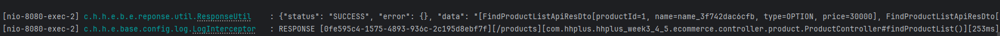
  - #### after (14ms)
    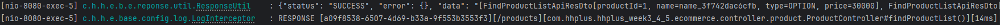
*****
상품 상세 조회
--------
- ### Code
  ```java
    @Service
    @AllArgsConstructor
    @Transactional(rollbackFor = {Exception.class}, readOnly = true)
    public class ProductServiceImpl implements ProductService {
      @Override
      @Transactional(rollbackFor = {Exception.class})
      @Cacheable(value = CacheConstants.ProductGroup.FIND_PRODUCT, key = "#productId")
      public Product findProductByProductId(Long productId) {
          Product product = productRepository.findByProductId(productId);
          if(product == null){
              throw new ProductCustomException(ProductEnums.Error.NO_PRODUCT);
          }
          // 상품 valid
          product.validate();
          return product;
      }
  }
  ```
- ### Cache 저장
  - #### 이유
    - 상품의 기본적인 정보(상품명, 사용여부)는 재고정보와 다르게 많이 수정되지 않는다고 생각했다.
    - productId(상품 ID)를 캐시의 key값으로 설정해서 각 상품별로 캐시가 형성되도록 적용시켰다.
    - 특정 상품이 삭제, 수정되면 해당 태시는 삭제된다.
  - #### before (100ms)
    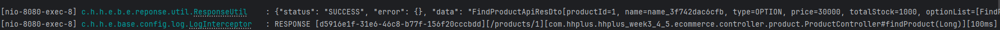
  - #### after (29ms)
    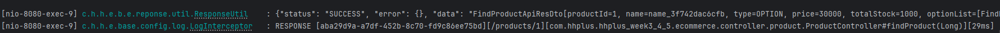

*****
상품 추가/수정/삭제
--------
- ### Code
  ```java
    @Service
    @AllArgsConstructor
    @Transactional(rollbackFor = {Exception.class}, readOnly = true)
    public class ProductServiceImpl implements ProductService {
      @Override
      @CacheEvict(value = CacheConstants.ProductGroup.FIND_PRODUCT_LIST, allEntries = true)
      @Transactional(rollbackFor = {Exception.class})
      public Long addProduct(AddProductApiReqDto reqDto) {
          // 상품 추가
      }
      
      @Override
      @Caching(evict = {
              @CacheEvict(value = CacheConstants.ProductGroup.FIND_PRODUCT_LIST, allEntries = true),
              @CacheEvict(value = CacheConstants.ProductGroup.FIND_PRODUCT, key = "#productId")
      })
      @Transactional(rollbackFor = {Exception.class})
      public Long putProduct(Long productId, PutProductApiReqDto reqDto) {
        // 상품 수정
      }
      
      @Override
      @Caching(evict = {
              @CacheEvict(value = CacheConstants.ProductGroup.FIND_PRODUCT_LIST, allEntries = true),
              @CacheEvict(value = CacheConstants.ProductGroup.FIND_PRODUCT, key = "#productId")
      })
      @Transactional(rollbackFor = {Exception.class})
      public Long delProduct(Long productId, PutProductApiReqDto reqDto) {
        // 상품 삭제
      }
  }
  ```
- ### Cache 삭제
  - #### 이유
    - 상품 추가
      - 특정 상품이 추가 시 상품목록조회에 걸려있는 모든 캐시가 삭제된다.
      - 상품 목록은 최신 등록한 상품이 들어있는 데이터를 보여주게 된다.
    - 상품 수정/삭제
      - 특정 상품이 수정/삭제 시 productId(상품 ID)가 key값인 상품상세조회에 걸려있는 캐시를 삭제한다.
      - 상품 상세정보는 최신 정보로 보여주게 된다.
  - #### before/after
    - 상품 추가
      1. 상품 목록 조회 (상품 목록 조회 캐시 저장 : 5ms)
        - 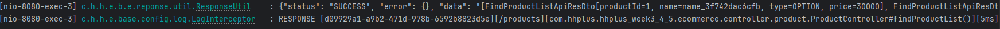
      2. 상품 추가 (상품 목록 조회 캐시 삭제) -> 상품 목록 재조회 (17ms)
        - 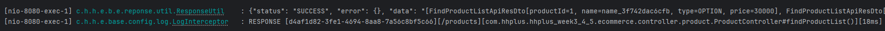
    - 상품 수정
      1. 상품 조회 (상품 조회 캐시 저장 : 22ms)
      - 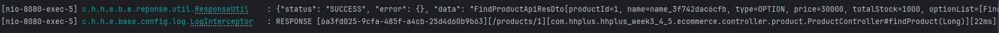
      2. 상품 수정 (상품 조회 캐시 삭제) -> 상품 재조회 (35ms)
      - 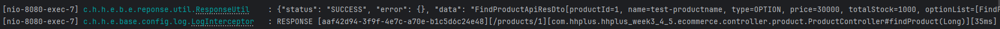
    - 상품 삭제
      1. 상품 조회 (상품 조회 캐시 저장 : 14ms)
      - 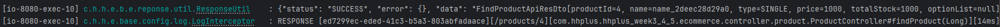
      2. 상품 삭제 (상품 조회 캐시 삭제) -> 상품 재조회 (171ms)
      - 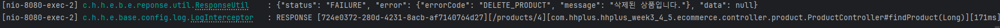
*****
상위 상품 조회
--------
- ### Code
  ```java
    @Service
    @AllArgsConstructor
    @Transactional(rollbackFor = {Exception.class}, readOnly = true)
    public class OrderServiceImpl implements OrderService {
      @Override
      @Cacheable(value = CacheConstants.ProductGroup.FIND_PRODUCT_RANKING, key = "#rankingType.name()")
      public List<Object[]> findTopProductsByBuyCnt(ProductEnums.Ranking rankingType) {
          LocalDateTime endDatetime = LocalDateTime.now();
          // 랭킹타입 별 시작일자 구하기
          LocalDateTime startDatetime = getStartDatetime(rankingType, endDatetime);
          // 주문 품목 내역에서 startDatetime, endDatetime 기반 가장 많이 팔린 상위 5개 상품 정보 조회
          List<Object[]> top5ProductList = orderItemRepository.findTopProductsByBuyCnt(startDatetime, endDatetime);
  
          if(top5ProductList.isEmpty()) {
              return new ArrayList<>();
          }
          return top5ProductList;
      }
  }
  ```
- ### Cache 저장
  - #### 이유
    - 각 랭킹타입 별 상위상품조회하는 로직을 크게 3일, 주간, 월간으로 타입을 나누어 적용했다.
    - 주문 데이터가 늘어날수록 실시간으로 조회하는데 오랜 시간이 걸릴 수 있다.
    - rankingType(랭킹 타입)을 캐시의 key값으로 설정해서 각 랭킹별로 캐시가 형성되도록 적용시켰다.
    - 캐시의 만료시간은 15분으로 설정되어 캐시를 삭제하지 않고 15분간 캐시를 다시 저장하도록 하였다.
  - #### before
    - 상위 상품 조회 (캐시 저장) - 상품ID(7,6,5,4,3)
     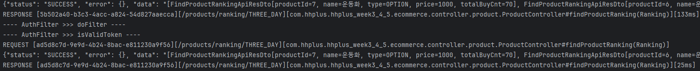
  - #### after
    - 캐시 만료 후 -> 상위 상품 조회 - 상품ID(20,10,19,9,18)
      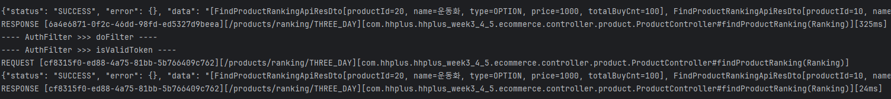