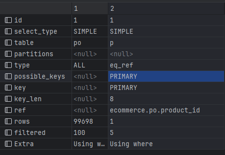
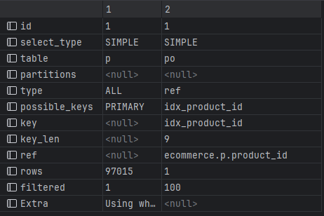
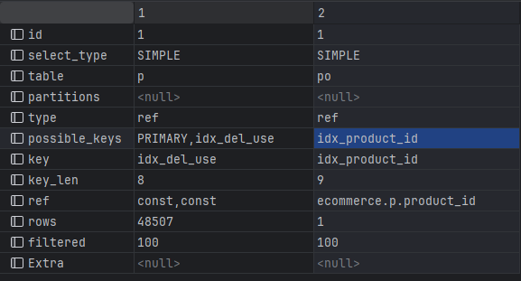
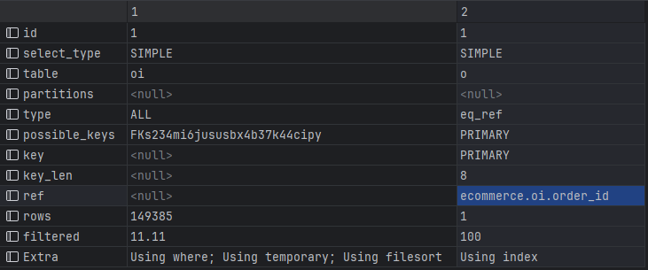
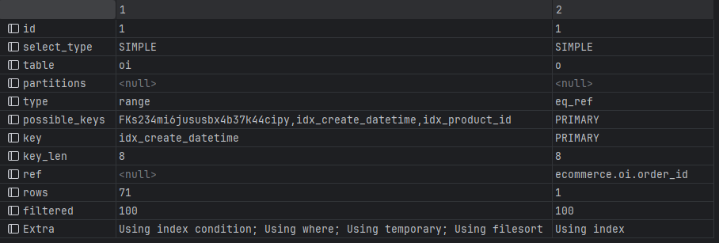
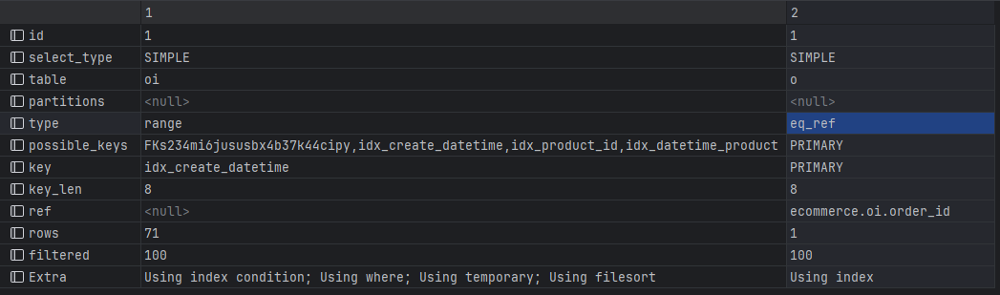

인덱스를 활용한 쿼리 성능개선
===========================
- 자주 조회하는 쿼리, 복잡한 쿼리 위주로 쿼리 파악 후 인덱스를 적용하여 성능 개선
  - 상품 목록 조회 : 전체 목록 조회이므로 상품 데이터가 늘어날수록 속도 저하 -> 개선 필요
  - 상위 상품 조회 : 전체 주문 목록에서 랭킹 타입 별 기간 내 인기상품 조회 -> 복잡한 쿼리, 주문데이터가 늘어날수록 속도 저하 -> 개선 필요
*****
상품 목록 조회
--------
**상품 목록에서 use_yn이 'Y', del_yn이 'N'인 전체 데이터 조회**
- 프로시저로 10만개 데이터 insert
```mysql
# product 테이블 10만개 데이터 insert 프로시저 생성
DELIMITER //

CREATE PROCEDURE insert_products()
BEGIN
  DECLARE i INT DEFAULT 0;

  WHILE i < 100000 DO
          INSERT INTO product (price, use_yn, create_datetime, modify_datetime, name, type, del_yn)
          VALUES (
                   FLOOR(RAND() * 1000),            -- 가격을 0~999 범위에서 랜덤으로 생성
                   'Y',                            -- 사용 여부
                   NOW(),                          -- 현재 시간
                   NULL,                           -- 수정 시간은 NULL
                   CONCAT('Product_', i),          -- 상품 이름
                   IF(RAND() > 0.5, 'SINGLE', 'OPTION'),  -- 상품 타입
                   'N'                             -- 삭제 여부
                 );

          SET i = i + 1;
    END WHILE;
END //

DELIMITER ;

# insert_products() 실행
call insert_products();

# product_option 테이블 10만개 데이터 insert 프로시저 생성  
DELIMITER //

CREATE PROCEDURE insert_product_options()
BEGIN
  DECLARE i INT DEFAULT 0;
  DECLARE max_product_id BIGINT;

  SELECT MAX(product_id) INTO max_product_id FROM product;

  -- 트랜잭션 시작
  START TRANSACTION;

  WHILE i < 100000 DO
          INSERT INTO product_option (price, use_yn, create_datetime, modify_datetime, product_id, option_name, option_value, type)
          VALUES (
                   FLOOR(RAND() * 1000),                  -- 가격을 0~999 범위에서 랜덤으로 생성
                   'Y',                                  -- 사용 여부
                   NOW(),                                -- 현재 시간
                   NULL,                                 -- 수정 시간은 NULL
                   FLOOR(1 + RAND() * max_product_id),   -- 랜덤한 상품 ID (1부터 max_product_id까지)
                   CONCAT('Option_', i),                 -- 옵션 이름
                   CONCAT('Value_', i),                  -- 옵션 값
                   IF(RAND() > 0.5, 'ADD', 'BASIC')      -- 옵션 타입
                 );

          SET i = i + 1;
    END WHILE;

  -- 트랜잭션 커밋
  COMMIT;
END //

DELIMITER ;

# insert_product_options() 실행
call insert_product_options();
```
----
- **as-is**
```mysql
  EXPLAIN SELECT * FROM product p
                          INNER JOIN product_option po ON p.product_id = po.product_id
          WHERE p.del_yn = 'N' AND p.use_yn = 'Y';
```

  - p -> product, po -> product_option
  - type
    - product
      - ALL : 전체 테이블 스캔 -> 인덱스 사용X
    - product_option
      - eq_ref : 인덱스 사용 -> 정확히 일치하는 행 찾음 -> product 테이블의 PRIMARY 인덱스
  - ref
    - product
      - ecommerce.po.product_id - 조인에서 product_option.product_id와 product.product_id 참조
    - product_option
      - NULL : 없음
  - rows (스캔할 예상 행 수)
    - product : '1'
    - product_option : '99698'
  - filtered (필터링)
    - product : 5% 
    - product_option : 100%

----
- 실행시간 측정
```mysql
  SET @start = NOW();
  SELECT * FROM product p
                  INNER JOIN product_option po ON p.product_id = po.product_id
  WHERE p.del_yn = 'N' AND p.use_yn = 'Y';
  SET @end = NOW();
  SELECT TIMEDIFF(@end, @start) AS execution_time;
```

---
- **Index - 1**
```mysql
 # 단일 인덱스 - (1)
  CREATE INDEX idx_product_id ON product_option (product_id);
```

- p -> product, po -> product_option
- product_option 테이블에서 product_id에 대한 인덱스 idx_product_id가 사용
- rows (스캔할 예상 행 수)
  - product : '1'
  - product_option : '97015' > 예상 행 수가 감소했다
----
- **Index - 2**
```mysql
 # 복합 인덱스 - (1)
    CREATE INDEX idx_del_use ON product (del_yn, use_yn);
```

- p -> product, po -> product_option
- product 테이블 접근방식이 ALL이다 => 복합 인덱스 추가 => 필터링 기능 향상
- idx_del_use 인덱스는 del_yn과 use_yn 열을 기준으로 생성된 복합 인덱스
  -  del_yn과 use_yn 조건을 필터링할 때 유용하게 사용
- product_option 테이블에서 product_id에 대한 인덱스 idx_product_id가 사용
- type
  - product, product_option
    - ref : 인덱스를 사용하여 행을 찾는 접근 방식
- rows (스캔할 예상 행 수)
  - product : '1'
  - product_option : '48507' > 예상 행 수가 단일인덱스 적용보다 더 감소했다.
- ref
  - product
    - ecommerce.po.product_id - 조인에서 product_option.product_id와 product.product_id 참조
  - product_option
    - const, const : 인덱스 조건이 상수값 -> 인덱스 검색이 더 빨라짐
*****
상위 상품 조회
--------
**주문 목록에서 기간 별 가장 많이 구매한 상품 순으로 조회**
- 프로시저로 15만개 데이터 insert
```mysql
# order 테이블 15만개 데이터 insert 프로시저 생성
DELIMITER //

CREATE PROCEDURE insert_orders(max_orders INT)
BEGIN
  DECLARE i INT DEFAULT 0;

  WHILE i < max_orders DO
          INSERT INTO `order` (all_buy_cnt, total_price, buyer_id, create_datetime, modify_datetime, order_sheet_id, buyer_name, order_number)
          VALUES (
                   FLOOR(RAND() * 100) + 1,  -- 총 구매 수량 (1~100 사이의 랜덤 값)
                   FLOOR(RAND() * 10000) + 100,  -- 총 상품 가격 (100~10100 사이의 랜덤 값)
                   FLOOR(RAND() * 1000) + 1,  -- 회원 ID (1~1000 사이의 랜덤 값)
                   NOW(),  -- 현재 시간
                   NULL,  -- 수정 시간
                   FLOOR(RAND() * 10000) + 1,  -- 주문서 ID (1~10000 사이의 랜덤 값)
                   CONCAT('Buyer_', i),  -- 주문자명
                   CONCAT('Order_', LPAD(i, 6, '0'))  -- 주문 번호 (6자리 숫자로 패딩)
                 );

          -- 반복문 카운터 증가
          SET i = i + 1;
    END WHILE;
END //

DELIMITER ;

CALL insert_orders(150000);


# order_item 테이블 15만개 데이터 insert 프로시저 생성
DELIMITER //

CREATE PROCEDURE insert_order_items(max_items INT)
BEGIN
  DECLARE i INT DEFAULT 0;
  DECLARE order_id BIGINT;
  DECLARE product_id BIGINT;
  DECLARE product_option_id BIGINT;
  DECLARE product_name VARCHAR(255);
  DECLARE product_option_name VARCHAR(255);
  DECLARE status ENUM('CANCEL_COMPLETE', 'DEPOSIT_COMPLETE', 'WAIT');

  WHILE i < max_items DO
          -- 랜덤으로 주문 ID 가져오기 (1부터 150000까지의 값)
          SET order_id = FLOOR(RAND() * 150000) + 1;

          -- 랜덤으로 상품 ID 설정 (1~20 사이의 랜덤 값)
          SET product_id = FLOOR(RAND() * 20) + 1;

          -- 랜덤으로 상품 옵션 ID 설정 (1~20 사이의 랜덤 값, 또는 NULL)
          SET product_option_id = IF(RAND() > 0.5, FLOOR(RAND() * 20) + 1, NULL);

          -- 랜덤으로 상품명과 상품 옵션명 설정
          SET product_name = CONCAT('Product_', product_id);
          SET product_option_name = IF(product_option_id IS NOT NULL, CONCAT('Option_', product_option_id), NULL);

          -- 랜덤으로 상태 설정
          SET status = IF(RAND() > 0.33, 'WAIT', IF(RAND() > 0.5, 'DEPOSIT_COMPLETE', 'CANCEL_COMPLETE'));

          -- 주문 품목 데이터 삽입
          INSERT INTO order_item (
            buy_cnt,
            product_price,
            create_datetime,
            modify_datetime,
            order_id,
            product_id,
            product_option_id,
            product_name,
            product_option_name,
            status
          )
          VALUES (
                   FLOOR(RAND() * 10) + 1,  -- 구매 수량 (1~10 사이의 랜덤 값)
                   FLOOR(RAND() * 1000) + 10,  -- 상품 가격 (10~1010 사이의 랜덤 값)
                   NOW(),  -- 현재 시간
                   NULL,  -- 수정 시간
                   order_id,  -- 방금 선택된 주문 ID
                   product_id,  -- 랜덤으로 생성된 상품 ID
                   product_option_id,  -- 랜덤으로 생성된 상품 옵션 ID (1~20 사이 또는 NULL)
                   product_name,  -- 상품명
                   product_option_name,  -- 상품 옵션명 (NULL일 경우 NULL)
                   status  -- 주문 상태
                 );

          -- 반복문 카운터 증가
          SET i = i + 1;
    END WHILE;
END //

DELIMITER ;

CALL insert_order_items(150000);
```
----
- **as-is**
```mysql
  EXPLAIN SELECT oi.product_id, SUM(oi.buy_cnt) AS total_buy_cnt
          FROM order_item oi
          INNER JOIN `order` o on oi.order_id = o.order_id
          WHERE oi.create_datetime BETWEEN '2024-08-07 00:00:00' AND '2024-08-09 23:59:59'
          GROUP BY oi.product_id
          ORDER BY total_buy_cnt DESC;
```

- oi -> order_item, o -> order
- type
  - order_item 
    - ALL : 전체 테이블 스캔 -> 인덱스 사용X -> 성능 감소
  - order 
    - eq_ref : order_id 열이 기본키 
- rows (스캔할 예상 행 수)
  - order_item
    - '149385'
  - order
    - '1'
- Extra
  - order_item
    - Using temporary : GROUP BY 수행 -> 임시 테이블 사용
    - Using filesort : 정렬 -> 성능 저하
  - order
    - Using index : 인덱스만으로 조회 > 추가적인 테이블 스캔 필요 X

----
- 실행시간 측정
```mysql
  SET @start = NOW();
  SELECT oi.product_id, SUM(oi.buy_cnt) AS total_buy_cnt
        FROM order_item oi
               INNER JOIN `order` o on oi.order_id = o.order_id
        WHERE oi.create_datetime BETWEEN '2024-08-07 00:00:00' AND '2024-08-09 23:59:59'
        GROUP BY oi.product_id
        ORDER BY total_buy_cnt DESC;
  SET @end = NOW();
  SELECT TIMEDIFF(@end, @start) AS execution_time;
```

---
- **Index - 1**
```mysql
 # 단일 인덱스 - (1)
  CREATE INDEX idx_create_datetime ON order_item (create_datetime);
  CREATE INDEX idx_product_id ON order_item (product_id);
```

- p -> product, po -> product_option
- create_datetime, product_id에 각각 단일 인덱스 추가
- possible_keys에 여러 인덱스가 표시 -> 쿼리를 최적화할 수 있는 인덱스 인식 => 효율적 사용은 아닐 수 있음
- rows (스캔할 예상 행 수)
  - order_item
    - '71' > 감소
  - order
    - '1'
- Using where; Using temporary; Using filesort
  - 인덱스를 추가해도 여전히 테이블 스캔 수행 => 추가적인 인덱스 최적화 필요
----
- **Index - 2**
```mysql
 # 복합 인덱스 - (1)
CREATE INDEX idx_datetime_product_buycnt ON order_item (create_datetime, product_id, buy_cnt);
```


- 쿼리에서 create_datetime, product_id, 그리고 buy_cnt가 모두 필요하므로 복합 인덱스를 사용하는 것이 좋다
- Using index condition 및 Using index 추가 > 인덱스만 사용하여 쿼리 처리
- Using temporary 및 Using filesort는 여전히 발생 
  - 복합 인덱스 추가 시 해당 성능이 개선될 것 같다는 예상과 달리 복합 인덱스를 추가하기 전과 동일한 성능을 보임
    - 쿼리 자체의 리팩토링이 필요할 수도 있다는 생각이 들었다.