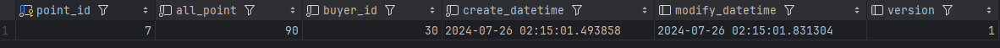
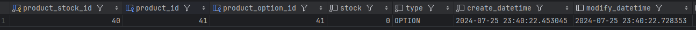
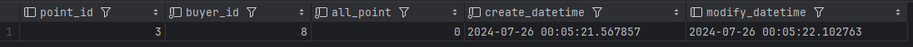
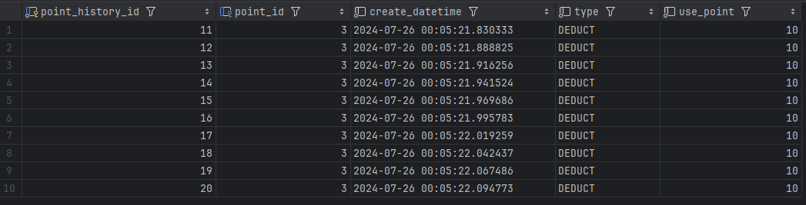

낙관적 락 vs 비관적 락
===========================
*****
테스트하기 전의 생각
-----
- 트랜잭션 간 충돌 빈도에 따라 결정된다.
  - 낙관적 락 
    - 충돌 빈도 낮음, 성능이 중요시 됨
  - 비관적 락
    - 충돌 빈도 높음, 데이터 정합성이 중요시 됨


- 상품 재고 차감, 잔액 사용은 데이터 수정이 빈번하기에 비관적 락이 더 좋다고 생각하며 진행했다. 
- 테스트 코드는 서비스 단위를 기준으로 시작하였다.
*****
낙관적 락
--------
- ### Key Point
  ```java
    @Version
    private Long version;
  ```
- **상품 재고 차감**
  - **테스트 코드**
  ```java
    @Test
    @DisplayName("동시 재고 차감 테스트 (10 스레드)")
    void deductProductStock_currency_success_10() throws InterruptedException, ExecutionException {
        // Given
        Product product = productFixture.add_usable_product();
        ProductOption option = productFixture.add_usable_product_option(product).get(0);
        productFixture.add_product_stock(product, option, 100);

        ProductStock productStock = productStockRepository.findProductStockByProductIdAndProductOptionId(product.getProductId(), option.getProductOptionId());

        CountDownLatch latch = new CountDownLatch(10);

        ExecutorService executorService = Executors.newFixedThreadPool(10);

        Callable<Void> task = () -> {
            try {
                log.info("Task start!");
                productStockServiceImpl.deductProductStock(product.getProductId(), option.getProductOptionId(), 1);
            } catch (ObjectOptimisticLockingFailureException e) {
                log.error("Exception occurred: ", e);
            } catch (Exception e) {
                throw new RuntimeException(e);
            } finally {
                log.info("CountDownLatch.countDown()");
                latch.countDown();
            }
            return null;
        };

        List<Future<Void>> futures = new ArrayList<>();
        for (int i = 0; i < 10; i++) {
            futures.add(executorService.submit(task));
        }

        latch.await();

        executorService.shutdown();

        boolean anyExceptionOccurred = false;

        for (Future<Void> future : futures) {
            try {
                future.get(); // Check if it throws an exception
            } catch (ExecutionException e) {
                Throwable cause = e.getCause();
                if (cause instanceof ObjectOptimisticLockingFailureException) {
                    anyExceptionOccurred = true;
                } else {
                    throw e; // Re-throw if not the expected exception
                }
            }
        }

        assertTrue(anyExceptionOccurred, "At least one task should have thrown ObjectOptimisticLockingFailureException.");
    }
  ```
  - **DB 데이터**
  

- **잔액 사용**
  - **테스트 코드**
  ```java
  @Test
  @DisplayName("잔액 사용 동시성 테스트 성공 - 스레드 (10)")
  void testConcurrentUsePoint() throws InterruptedException {
      // given
      // 잔액 100 세팅
      Buyer buyer = buyerFixture.add_buyer();
      Point point = pointFixture.add_point(buyer.getBuyerId(), 100);

      // CountDownLatch
      CountDownLatch latch = new CountDownLatch(10);

      // 스레드 10개 설정
      ExecutorService executorService = Executors.newFixedThreadPool(10);

      // Callable task
      Callable<Void> task = () -> {
          try {
              log.info("Task start!");
              // 잔액 사용 10원씩 실행
              pointServiceImpl.usePoint(buyer.getBuyerId(), 10);
          } catch (Exception e) {
              log.error("Exception occurred: ", e);
          } finally {
              log.info("CountDownLatch.countDown()");
              latch.countDown();
          }
          return null;
      };

      // 10개 task 전송
      List<Future<Void>> futures = new ArrayList<>();
      for (int i = 0; i < 10; i++) {
          futures.add(executorService.submit(task));
      }

      // task 기다리기
      latch.await();

      executorService.shutdown();

      // 잔액이 올바르게 차감되었는지 확인
      int finalPoint = pointServiceImpl.findPoint(buyer.getBuyerId());
      int expectedBalance = 90;
      assertEquals(expectedBalance, finalPoint, "The point should be reduced correctly after all deductions.");
  }
  ```
  - **DB 데이터**
  
*****
비관적 락
---
- ### Key Point
  ```java
    @Lock(LockModeType.PESSIMISTIC_WRITE)
  ```
- ### **상품 재고 차감**
  - #### **테스트 코드**
  ```java
    @Test
    @DisplayName("재고 차감 동시성 테스트 성공 - 스레드 (10)")
    void deductProductStock_currency_success() throws InterruptedException {
        // given
        // 상품 재고 100개 세팅
        Product product = productFixture.add_usable_product();
        ProductOption option = productFixture.add_usable_product_option(product).get(0);
        productFixture.add_product_stock(product, option, 100);

        // CountDownLatch
        CountDownLatch latch = new CountDownLatch(10);

        // 스레드 10개 설정
        ExecutorService executorService = Executors.newFixedThreadPool(10);

        // Callable task
        Callable<Void> task = () -> {
            try {
                // 재고 차감 10개씩 실행`
                log.info("task start !");
                productStockServiceImpl.deductProductStock(product.getProductId(), option.getProductOptionId(), 10);
            } catch (Exception e) {
                log.error("Exception occurred: ", e);
            } finally {
                log.info("CountDownLatch.countDown()");
                latch.countDown();
            }
            return null;
        };

        // 10개 task 전송
        List<Future<Void>> futures = new ArrayList<>();
        for (int i = 0; i < 10; i++) {
            futures.add(executorService.submit(task));
        }

        // task 기다리기
        latch.await();

        executorService.shutdown();

        // 재고가 10개씩 차감되었는지 확인 100 - (10 * 10) = 0
        ProductStock finalProductStock = productStockServiceImpl.findProductStockByProductIdAndProductOptionId(product.getProductId(), option.getProductOptionId());
        assertEquals(0, finalProductStock.getStock(), "The product stock should be reduced to 0 after all deductions.");
    }
  ```
  - #### **DB 데이터**
    

- ### **잔액 사용**
  - #### **테스트 코드**
  ```java
  @Test
  @DisplayName("잔액 사용 동시서 테스트 성공 - 스레드 (10)")
  void usePoint_currency_success() throws InterruptedException {
      // given
      // 잔액 100 세팅
      Buyer buyer = buyerFixture.add_buyer();
      Point point = pointFixture.add_point(buyer.getBuyerId(), 100);

      // CountDownLatch
      CountDownLatch latch = new CountDownLatch(10);

      // 스레드 10개 설정
      ExecutorService executorService = Executors.newFixedThreadPool(10);

      // Callable task
      Callable<Void> task = () -> {
          try {
              log.info("Task start!");
              // 잔액 사용 10원씩 실행
              pointServiceImpl.usePoint(buyer.getBuyerId(), 10);
          } catch (Exception e) {
              log.error("Exception occurred: ", e);
          } finally {
              log.info("CountDownLatch.countDown()");
              latch.countDown();
          }
          return null;
      };

      // 10개 task 전송
      List<Future<Void>> futures = new ArrayList<>();
      for (int i = 0; i < 10; i++) {
          futures.add(executorService.submit(task));
      }

      // task 기다리기
      latch.await();

      executorService.shutdown();

      // 잔액이 10원씩 차감되었는지 확인 100 - (10 * 10) = 0
      int finalPoint = pointServiceImpl.findPoint(buyer.getBuyerId());
      int expectedBalance = point.getAllPoint() - 10 * 10;
      assertEquals(expectedBalance, finalPoint, "The point should be reduced correctly after all deductions.");
  }
  ```
  - #### **DB 데이터**
    
    
*****
정리
---------
### 낙관적 락 (Optimistic Lock)
 - #### 개념
   - 동시적 요청을 현재 트랜잭션의 데이터를 커밋하기 전 다른 트랜잭션에서 확인 -> 데이터 수정 방지
   - version을 통해서 확인함
     - 만약 다를 경우 트랜잭션을 롤백 or 재시도 -> 동시성 이슈 처리
 - #### 장점
   - DB에 락을 걸지 않음 -> 비관적 락보다 성능이 좋을 수 있음
   - 많은 유저들이 동시에 데이터에 접근하도록 함 -> 처리량 높음
 - #### 단점
   - 데이터가 충돌하면 -> 이를 방지할 추가적인 로직을 구현해야 함 -> 복잡도가 올라감
 - #### 나의 경험
   - 개념자체를 이해하는데 비관적 락보다 개인적으로 더 어려웠다.
   - 구현자체는 간단해서 바로 적용해볼 수 있었고, 빠른 시간안에 조회해서 성능을 높여주는 상품리스트, 주문리스트 조회와 같은 로직에 사용하면 더 좋을 것 같은 생각이다. 
### 비관적 락 (Pessimistic Lock)
- #### 개념
  - 한 트랜잭션이 table에 접근하면 -> 락을 걸어서 -> 해제될 때까지 다른 트랜잭션에서 접근 X
  - 트랜잭션이 진행하는 동안 락이 걸린다 -> 대기시간 발생할 수 있음
- #### 장점
  - table에 락을 걸어서 다른 트랜잭션 접근 X -> 데이터 일관성 보장할 수 있음
  - 데이터가 변경 중 다른 트랜잭션과 충돌할 가능성이 낮아짐
- #### 단점
  - 많은 유저들이 동시 접속하면 락의 대기시간으로 인해 성능이 떨어질 수 있음
  - N개의 트랜잭션이 다른 순서로 데이터 요청 -> 데드락 발생 가능성 높음
- #### 나의 경험
  - 낙관적 락보다 구현하는 방식이 더 익숙해서 쉽게 적용할 수 있었다.
  - 단순한 읽기 기능이 아니라 데이터를 추가/수정/삭제하는 로직이기에, 비관적 락을 이용해 정합성이 유지되는 것을 볼 수 있었다.